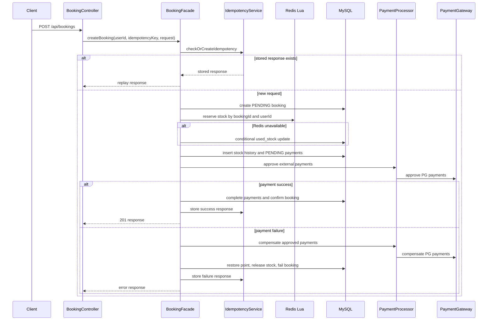
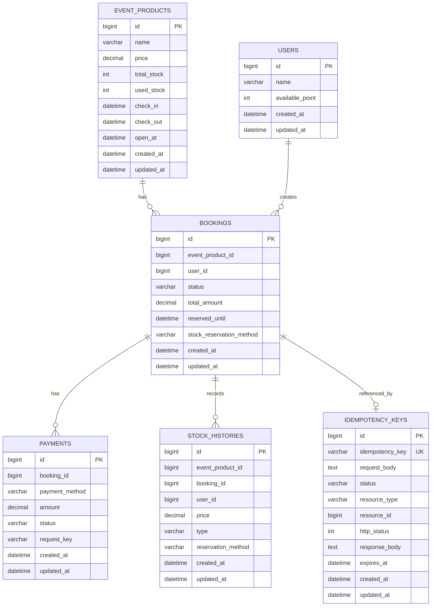

# 예약 서버

00:00에 오픈되는 한정 수량 숙박 상품을 대상으로 주문서 조회와 예약 결제를 처리하는 Spring Boot 서버입니다.

## 1. 시스템 구조

```text
Client
  -> Controller
  -> Facade
  -> Transactional Service
  -> Component
  -> Repository / RedisClient / PaymentProcessor
  -> MySQL / Redis / External Payment Adapter
```

각 계층의 역할은 다음과 같습니다.

```text
Controller
- HTTP 요청과 응답을 처리합니다.
- 헤더와 요청 본문 검증을 수행합니다.

Facade
- 예약 생성 use case의 전체 순서를 제어합니다.
- Redis 재고 선점, DB transaction, 외부 결제, 보상 흐름을 조합합니다.
- 외부로 노출할 예외 응답을 변환합니다.

Transactional Service
- 짧은 DB transaction 단위를 제공합니다.
- booking, payment, point, stock history, idempotency 상태를 변경합니다.

Component
- 도메인별 조회, 저장, 검증, Redis 연산, 결제 전략 실행을 담당합니다.

Repository
- JPA 기반 persistence 접근을 담당합니다.
- 조건부 update와 조회 query를 제공합니다.
```

핵심 설계는 다음과 같습니다.

- `GET /api/checkout`은 상태를 변경하지 않는 조회 API입니다.
- `POST /api/bookings`만 재고, 결제, 포인트, 예약 상태를 변경합니다.
- Redis Set과 Lua script로 재고 선점을 원자적으로 처리합니다.
- Redis 장애 시 MySQL 조건부 update로 제한된 DB fallback을 수행합니다.
- 동일 사용자는 같은 상품을 1개만 예약할 수 있습니다.
- 멱등키는 DB table에 저장하며 완료/실패 응답을 재사용합니다.
- 결제 수단은 `PaymentProcessor` 전략 구현체로 확장합니다.
- 외부 승인/취소 연결점은 `PaymentGateway`로 분리합니다.

## 2. 프로젝트 구조

```text
src/main/java/booking/server
  global
    config          - Clock, fallback executor, OpenAPI, local seed 설정입니다.
    exception       - 공통 예외 응답입니다.
    redis           - RedisTemplate wrapper입니다.
  domain
    checkout        - 주문서 진입 조회 API입니다.
    booking         - 예약 생성 orchestration, entity, dto입니다.
    payment         - 결제 검증, 결제 수단별 processor/gateway입니다.
    stock           - Redis 재고 선점, DB fallback, stock history입니다.
    idempotency     - 멱등키 저장과 응답 재생입니다.
    eventproduct    - 상품 조회, cache, 재고 조건부 update입니다.
    user            - 사용자 포인트 조회, 차감, 복구입니다.
    recovery        - pending 예약, payment unknown, Redis rebuild 보정입니다.
docs                - 요구사항, 상세 flow, 테스트 정리 문서입니다.
```

## 3. 실행 방법

필요한 환경은 다음과 같습니다.

- Java 17입니다.
- Docker가 필요합니다.
- MySQL과 Redis는 `docker-compose.yml`로 제공합니다.

MySQL과 Redis를 실행합니다.

```bash
docker compose up -d
```

`local` 프로필로 Spring Boot 애플리케이션을 실행합니다.

```bash
SPRING_PROFILES_ACTIVE=local ./gradlew bootRun
```

애플리케이션 시작 시 `spring.jpa.hibernate.ddl-auto=create` 설정에 따라 MySQL schema가 생성됩니다. Schema 생성 이후 `local` 프로필 seeder가 demo MySQL row와 Redis key를 자동으로 삽입합니다. 채점자가 SQL이나 Redis 명령을 직접 실행할 필요는 없습니다.

`bootRun`은 웹 서버 프로세스이기 때문에 종료되지 않고 계속 실행되는 것이 정상입니다. 아래 로그가 보이면 준비가 완료된 상태입니다.

```text
Tomcat started on port 8080
Started ServerApplication
```

Swagger UI는 다음 주소에서 확인할 수 있습니다.

```text
http://localhost:8080/swagger-ui.html
```

Swagger 테스트에 사용할 기본 값은 다음과 같습니다.

```text
userId: 1
eventProductId: 1
price: 50000
Idempotency-Key: swagger-001 같은 고유 문자열입니다.
```

Swagger 테스트 순서는 다음과 같습니다.

1. `GET /api/checkout`을 실행합니다. 헤더는 `userId=1`, 쿼리 파라미터는 `eventProductId=1`입니다.
2. `POST /api/bookings`를 실행합니다. 헤더는 `userId=1`, `Idempotency-Key=swagger-001`입니다.
3. 요청 본문은 다음과 같습니다.

```json
{
  "eventProductId": 1,
  "payments": [
    {
      "paymentMethod": "CREDIT_CARD",
      "amount": 50000
    }
  ]
}
```

`POST /api/bookings`를 반복 테스트할 때는 `Idempotency-Key`를 `swagger-002`, `swagger-003`처럼 새 값으로 바꾸는 것이 좋습니다. 같은 key를 다시 보내면 멱등성 정책에 따라 저장된 응답이 재사용됩니다.

## 4. 로컬 인프라 정보

Docker Compose로 실행되는 기본 접속 정보는 다음과 같습니다.

```text
MySQL host: localhost
MySQL port: 13306
Database: booking_server
Username: booking
Password: booking

Redis host: localhost
Redis port: 16379
```

실행 중인 demo data를 다시 초기화하려면 다음 명령을 사용합니다.

```bash
bash scripts/seed-local.sh
```

OpenAPI JSON 문서는 다음 주소에서 확인할 수 있습니다.

```text
http://localhost:8080/v3/api-docs
```

Postman으로 동일하게 테스트하려면 다음 요청을 사용합니다.

```text
GET http://localhost:8080/api/checkout?eventProductId=1
헤더:
  userId: 1
```

```text
POST http://localhost:8080/api/bookings
헤더:
  Content-Type: application/json
  userId: 1
  Idempotency-Key: postman-001
```

```json
{
  "eventProductId": 1,
  "payments": [
    {
      "paymentMethod": "CREDIT_CARD",
      "amount": 50000
    }
  ]
}
```

## 5. 테스트 실행

테스트는 H2 인메모리 DB를 사용합니다. 따라서 단위 테스트 실행에는 MySQL과 Redis가 필요하지 않습니다.

```bash
./gradlew test
./gradlew jacocoTestCoverageVerification
```

인프라를 중지하려면 다음 명령을 사용합니다.

```bash
docker compose down
```

로컬 데이터까지 삭제해도 되는 경우에만 volume을 함께 제거합니다.

```bash
docker compose down -v
```

## 6. API 목록

### Checkout 조회 API

```text
GET /api/checkout?eventProductId={eventProductId}
헤더:
  userId: Long
```

응답 예시는 다음과 같습니다.

```json
{
  "eventProductId": 1,
  "name": "Postman Hotel Package",
  "price": 50000,
  "checkInAt": "2026-06-01T15:00:00",
  "checkOutAt": "2026-06-02T11:00:00",
  "openAt": "2026-05-10T00:00:00",
  "user": {
    "userId": 1,
    "name": "Postman User",
    "availablePoint": 100000
  }
}
```

### Booking 생성 API

```text
POST /api/bookings
헤더:
  userId: Long
  Idempotency-Key: String
```

요청 예시는 다음과 같습니다.

```json
{
  "eventProductId": 1,
  "payments": [
    {
      "paymentMethod": "CREDIT_CARD",
      "amount": 50000
    }
  ]
}
```

응답 예시는 다음과 같습니다.

```json
{
  "bookingId": 1,
  "eventProductId": 1,
  "userId": 1,
  "status": "CONFIRMED",
  "totalAmount": 50000,
  "reservedUntil": "2026-05-10T00:03:00",
  "payments": [
    {
      "paymentId": 1,
      "paymentMethod": "CREDIT_CARD",
      "amount": 50000,
      "status": "COMPLETED"
    }
  ]
}
```

요청 검증 규칙은 다음과 같습니다.

- `userId` header는 필수이며 양수여야 합니다.
- `Idempotency-Key` header는 필수이며 공백일 수 없습니다.
- `eventProductId`는 필수입니다.
- `payments`는 필수이며 비어 있을 수 없습니다.
- `paymentMethod`는 필수입니다.
- `amount`는 필수이며 양수여야 합니다.
- `CREDIT_CARD + Y_PAY` 조합은 허용하지 않습니다.
- `CREDIT_CARD + Y_POINT` 조합은 허용합니다.
- `Y_PAY + Y_POINT` 조합은 허용합니다.
- 결제 금액 합계는 상품 가격과 같아야 합니다.

## 7. 예약 생성 흐름



## 8. DDL

현재 애플리케이션은 `ddl-auto=create`로 schema를 생성합니다. 참고용 DDL은 다음과 같습니다.

```sql
CREATE TABLE event_products (
    id BIGINT NOT NULL AUTO_INCREMENT,
    name VARCHAR(255) NOT NULL,
    price DECIMAL(19, 0) NOT NULL,
    total_stock INT NOT NULL,
    used_stock INT NOT NULL,
    check_in DATETIME NOT NULL,
    check_out DATETIME NOT NULL,
    open_at DATETIME NOT NULL,
    created_at DATETIME NOT NULL,
    updated_at DATETIME NOT NULL,
    PRIMARY KEY (id),
    KEY idx_event_products_open_at (open_at)
);

CREATE TABLE users (
    id BIGINT NOT NULL AUTO_INCREMENT,
    name VARCHAR(255) NOT NULL,
    available_point INT NOT NULL,
    created_at DATETIME NOT NULL,
    updated_at DATETIME NOT NULL,
    PRIMARY KEY (id)
);

CREATE TABLE bookings (
    id BIGINT NOT NULL AUTO_INCREMENT,
    event_product_id BIGINT NOT NULL,
    user_id BIGINT NOT NULL,
    status VARCHAR(30) NOT NULL,
    total_amount DECIMAL(19, 0) NOT NULL,
    reserved_until DATETIME NOT NULL,
    stock_reservation_method VARCHAR(20) NOT NULL,
    created_at DATETIME NOT NULL,
    updated_at DATETIME NOT NULL,
    PRIMARY KEY (id),
    KEY idx_bookings_status_reserved_until (status, reserved_until),
    KEY idx_bookings_status (status)
);

CREATE TABLE payments (
    id BIGINT NOT NULL AUTO_INCREMENT,
    booking_id BIGINT NOT NULL,
    payment_method VARCHAR(30) NOT NULL,
    amount DECIMAL(19, 0) NOT NULL,
    status VARCHAR(30) NOT NULL,
    request_key VARCHAR(100) NOT NULL,
    created_at DATETIME NOT NULL,
    updated_at DATETIME NOT NULL,
    PRIMARY KEY (id),
    KEY idx_payments_booking_id (booking_id),
    KEY idx_payments_status (status)
);

CREATE TABLE stock_histories (
    id BIGINT NOT NULL AUTO_INCREMENT,
    event_product_id BIGINT NOT NULL,
    booking_id BIGINT NOT NULL,
    user_id BIGINT NOT NULL,
    price DECIMAL(19, 0) NOT NULL,
    type VARCHAR(20) NOT NULL,
    reservation_method VARCHAR(20) NOT NULL,
    created_at DATETIME NOT NULL,
    updated_at DATETIME NOT NULL,
    PRIMARY KEY (id),
    UNIQUE KEY uk_stock_histories_booking_type (event_product_id, booking_id, type),
    KEY idx_stock_histories_event_product_id (event_product_id),
    KEY idx_stock_histories_booking_id (booking_id),
    KEY idx_stock_histories_user_id (user_id),
    KEY idx_stock_histories_event_product_user (event_product_id, user_id)
);

CREATE TABLE idempotency_keys (
    id BIGINT NOT NULL AUTO_INCREMENT,
    idempotency_key VARCHAR(100) NOT NULL,
    request_body TEXT NOT NULL,
    status VARCHAR(30) NOT NULL,
    resource_type VARCHAR(30),
    resource_id BIGINT,
    http_status INT,
    response_body TEXT,
    expires_at DATETIME NOT NULL,
    created_at DATETIME NOT NULL,
    updated_at DATETIME NOT NULL,
    PRIMARY KEY (id),
    UNIQUE KEY uk_idempotency_keys_key (idempotency_key),
    KEY idx_idempotency_keys_expires_at (expires_at)
);
```

## 9. ERD



## 10. Redis Key

```text
checkout:event-product:{eventProductId}
- 타입: String입니다.
- 값: EventProduct JSON입니다.
- 목적: checkout 상품 cache입니다.

event-product:{eventProductId}:stock:used
- 타입: Set입니다.
- 멤버: bookingId입니다.
- 목적: Redis 기준 활성 재고 선점 수를 계산하기 위한 key입니다.

event-product:{eventProductId}:stock:users
- 타입: Set입니다.
- 멤버: userId입니다.
- 목적: 같은 사용자가 같은 상품을 1개만 예약하도록 제한하기 위한 key입니다.

event-product:{eventProductId}:stock:sold-out
- 타입: String입니다.
- 목적: 짧은 TTL을 가진 sold-out marker입니다.
```
