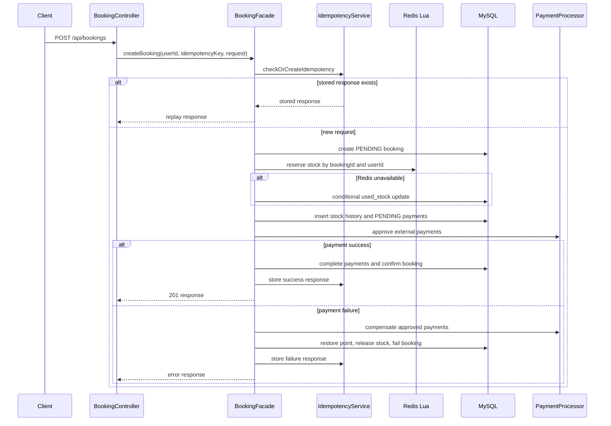
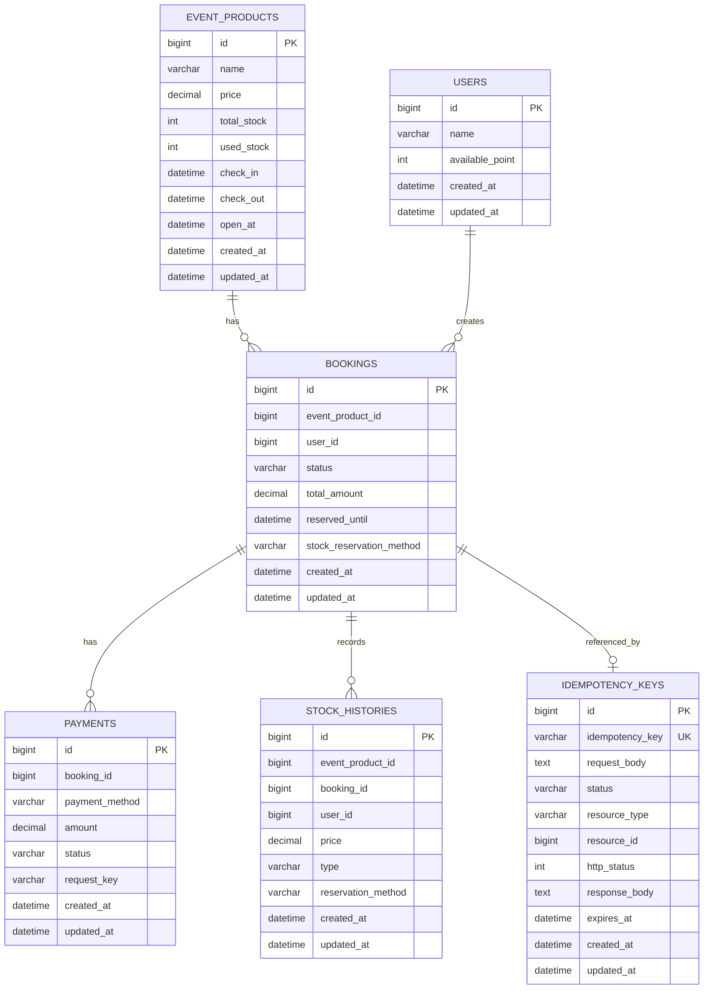

# Booking Server

00:00에 오픈되는 한정 수량 숙박 상품을 대상으로 checkout 조회와 booking 결제/예약 완료를 처리하는 Spring Boot 서버입니다.

## 1. System Architecture

```text
Client
  -> Controller
  -> Facade
  -> Transactional Service
  -> Component
  -> Repository / RedisClient / PaymentProcessor
  -> MySQL / Redis / External Payment Adapter
```

주요 책임:

```text
Controller
- Header, request body validation
- HTTP request/response 처리

Facade
- Booking use case 순서 제어
- Redis 재고 선점, DB transaction, 외부 결제, 보상 흐름 조합
- 외부로 노출할 예외 변환

Transactional Service
- 짧은 DB transaction 단위 제공
- booking, payment, point, stock history, idempotency 상태 변경

Component
- 도메인별 조회, 저장, 검증, Redis 연산, 결제 전략 실행

Repository
- JPA 기반 persistence 접근
- 조건부 update와 조회 query 제공
```

핵심 설계:

- `GET /api/checkout`은 상태를 변경하지 않는 조회 API입니다.
- `POST /api/bookings`만 재고, 결제, 포인트, 예약 상태를 변경합니다.
- Redis Set과 Lua script로 재고 선점을 원자 처리합니다.
- Redis 장애 시 MySQL 조건부 update로 제한된 DB fallback을 수행합니다.
- 동일 사용자는 같은 상품을 1개만 예약할 수 있습니다.
- 멱등키는 DB table에 저장하며, 완료/실패 응답을 재사용합니다.
- 결제 수단은 `PaymentProcessor` 전략 구현체로 확장합니다.

## 2. Project Structure

```text
src/main/java/booking/server
  global
    config          - Clock, fallback executor 설정
    exception       - 공통 예외 응답
    redis           - RedisTemplate wrapper
  domain
    checkout        - 주문서 진입 조회 API
    booking         - 예약 생성 orchestration, entity, dto
    payment         - 결제 검증, 결제 수단별 processor
    stock           - Redis 재고 선점, DB fallback, stock history
    idempotency     - 멱등키 저장과 응답 재생
    eventproduct    - 상품 조회/cache/재고 조건부 update
    user            - 사용자 포인트 조회/차감/복구
    recovery        - pending 예약, payment unknown, Redis rebuild 보정
docs                - 요구사항, 상세 flow, 테스트 정리 문서
```

## 3. Run

### Requirements

- Java 17
- Docker
- Redis and MySQL are provided by `docker-compose.yml`

### Evaluator Quick Start

Run MySQL and Redis:

```bash
docker compose up -d
```

Run the Spring Boot application with the `local` profile:

```bash
SPRING_PROFILES_ACTIVE=local ./gradlew bootRun
```

On startup, Hibernate creates the MySQL schema because `spring.jpa.hibernate.ddl-auto` is set to `create`. After the schema is created, the `local` profile seeder inserts demo MySQL rows and Redis keys automatically. No manual SQL or Redis command is required.

`bootRun` keeps running because it is the web server process. It is ready when the log contains:

```text
Tomcat started on port 8080
Started ServerApplication
```

Open Swagger UI:

```text
http://localhost:8080/swagger-ui.html
```

Use these default values in Swagger:

```text
userId: 1
eventProductId: 1
price: 50000
Idempotency-Key: any unique string, for example swagger-001
```

Recommended Swagger test order:

1. `GET /api/checkout` with header `userId=1` and query `eventProductId=1`.
2. `POST /api/bookings` with headers `userId=1`, `Idempotency-Key=swagger-001`.
3. Use this request body:

```json
{
  "eventProductId": 1,
  "payments": [
    {
      "paymentMethod": "CREDIT_CARD",
      "amount": 50000
    }
  ]
}
```

If you repeat `POST /api/bookings`, change `Idempotency-Key` to a new value such as `swagger-002`. The same key intentionally replays the saved idempotent response.

### Start Infrastructure

```bash
docker compose up -d
```

Default infrastructure:

```text
MySQL host: localhost
MySQL port: 13306
Database: booking_server
Username: booking
Password: booking

Redis host: localhost
Redis port: 16379
```

### Run Application

```bash
SPRING_PROFILES_ACTIVE=local ./gradlew bootRun
```

The default datasource and Redis connection are defined in `src/main/resources/application.yaml`.
The app currently uses `spring.jpa.hibernate.ddl-auto=create`, so the schema is recreated when the application starts. With the `local` profile, demo MySQL rows and Redis keys are seeded automatically after the schema is ready.

### Demo Data for Swagger or Postman

The application automatically prepares this local demo data:

```text
userId: 1
eventProductId: 1
price: 50000
```

If you want to reset the demo data while the app is already running, run:

```bash
bash scripts/seed-local.sh
```

Swagger UI:

```text
http://localhost:8080/swagger-ui.html
```

OpenAPI JSON:

```text
http://localhost:8080/v3/api-docs
```

Equivalent Postman request:

```text
GET http://localhost:8080/api/checkout?eventProductId=1
Header:
  userId: 1
```

```text
POST http://localhost:8080/api/bookings
Header:
  Content-Type: application/json
  userId: 1
  Idempotency-Key: postman-001
```

```json
{
  "eventProductId": 1,
  "payments": [
    {
      "paymentMethod": "CREDIT_CARD",
      "amount": 50000
    }
  ]
}
```

### Run Tests

```bash
./gradlew test
./gradlew jacocoTestCoverageVerification
```

Tests use H2, so MySQL and Redis are not required for unit tests.

### Stop Infrastructure

```bash
docker compose down
```

Remove volumes only when local data can be deleted:

```bash
docker compose down -v
```

## 4. API List

### GET Checkout

```text
GET /api/checkout?eventProductId={eventProductId}
Header:
  userId: Long
```

Response example:

```json
{
  "eventProductId": 1,
  "name": "Hotel Package A",
  "price": 100000,
  "checkInAt": "2026-06-01T15:00:00",
  "checkOutAt": "2026-06-02T11:00:00",
  "openAt": "2026-05-10T00:00:00",
  "user": {
    "userId": 10,
    "name": "user",
    "availablePoint": 30000
  }
}
```

### POST Booking

```text
POST /api/bookings
Header:
  userId: Long
  Idempotency-Key: String
```

Request example:

```json
{
  "eventProductId": 1,
  "payments": [
    {
      "paymentMethod": "CREDIT_CARD",
      "amount": 90000
    },
    {
      "paymentMethod": "Y_POINT",
      "amount": 10000
    }
  ]
}
```

Response example:

```json
{
  "bookingId": 100,
  "eventProductId": 1,
  "userId": 10,
  "status": "CONFIRMED",
  "totalAmount": 100000,
  "reservedUntil": "2026-05-10T00:03:00",
  "payments": [
    {
      "paymentId": 1,
      "paymentMethod": "CREDIT_CARD",
      "amount": 90000,
      "status": "COMPLETED"
    },
    {
      "paymentId": 2,
      "paymentMethod": "Y_POINT",
      "amount": 10000,
      "status": "COMPLETED"
    }
  ]
}
```

Validation:

- `userId` header is required and positive.
- `Idempotency-Key` header is required and not blank.
- `eventProductId` is required.
- `payments` is required and not empty.
- `paymentMethod` is required.
- `amount` is required and positive.
- `CREDIT_CARD + Y_PAY` is rejected.
- `CREDIT_CARD + Y_POINT` is allowed.
- `Y_PAY + Y_POINT` is allowed.
- Total payment amount must equal product price.

## 5. Booking Flow



## 6. DDL

```sql
CREATE TABLE event_products (
    id BIGINT NOT NULL AUTO_INCREMENT,
    name VARCHAR(255) NOT NULL,
    price DECIMAL(19, 0) NOT NULL,
    total_stock INT NOT NULL,
    used_stock INT NOT NULL,
    check_in DATETIME NOT NULL,
    check_out DATETIME NOT NULL,
    open_at DATETIME NOT NULL,
    created_at DATETIME NOT NULL,
    updated_at DATETIME NOT NULL,
    PRIMARY KEY (id),
    KEY idx_event_products_open_at (open_at)
);

CREATE TABLE users (
    id BIGINT NOT NULL AUTO_INCREMENT,
    name VARCHAR(255) NOT NULL,
    available_point INT NOT NULL,
    created_at DATETIME NOT NULL,
    updated_at DATETIME NOT NULL,
    PRIMARY KEY (id)
);

CREATE TABLE bookings (
    id BIGINT NOT NULL AUTO_INCREMENT,
    event_product_id BIGINT NOT NULL,
    user_id BIGINT NOT NULL,
    status VARCHAR(30) NOT NULL,
    total_amount DECIMAL(19, 0) NOT NULL,
    reserved_until DATETIME NOT NULL,
    stock_reservation_method VARCHAR(20) NOT NULL,
    created_at DATETIME NOT NULL,
    updated_at DATETIME NOT NULL,
    PRIMARY KEY (id),
    KEY idx_bookings_status_reserved_until (status, reserved_until),
    KEY idx_bookings_status (status)
);

CREATE TABLE payments (
    id BIGINT NOT NULL AUTO_INCREMENT,
    booking_id BIGINT NOT NULL,
    payment_method VARCHAR(30) NOT NULL,
    amount DECIMAL(19, 0) NOT NULL,
    status VARCHAR(30) NOT NULL,
    request_key VARCHAR(100) NOT NULL,
    created_at DATETIME NOT NULL,
    updated_at DATETIME NOT NULL,
    PRIMARY KEY (id),
    KEY idx_payments_booking_id (booking_id),
    KEY idx_payments_status (status)
);

CREATE TABLE stock_histories (
    id BIGINT NOT NULL AUTO_INCREMENT,
    event_product_id BIGINT NOT NULL,
    booking_id BIGINT NOT NULL,
    user_id BIGINT NOT NULL,
    price DECIMAL(19, 0) NOT NULL,
    type VARCHAR(20) NOT NULL,
    reservation_method VARCHAR(20) NOT NULL,
    created_at DATETIME NOT NULL,
    updated_at DATETIME NOT NULL,
    PRIMARY KEY (id),
    UNIQUE KEY uk_stock_histories_booking_type (event_product_id, booking_id, type),
    KEY idx_stock_histories_event_product_id (event_product_id),
    KEY idx_stock_histories_booking_id (booking_id),
    KEY idx_stock_histories_user_id (user_id),
    KEY idx_stock_histories_event_product_user (event_product_id, user_id)
);

CREATE TABLE idempotency_keys (
    id BIGINT NOT NULL AUTO_INCREMENT,
    idempotency_key VARCHAR(100) NOT NULL,
    request_body TEXT NOT NULL,
    status VARCHAR(30) NOT NULL,
    resource_type VARCHAR(30),
    resource_id BIGINT,
    http_status INT,
    response_body TEXT,
    expires_at DATETIME NOT NULL,
    created_at DATETIME NOT NULL,
    updated_at DATETIME NOT NULL,
    PRIMARY KEY (id),
    UNIQUE KEY uk_idempotency_keys_key (idempotency_key),
    KEY idx_idempotency_keys_expires_at (expires_at)
);
```

## 7. ERD



## 8. Redis Keys

```text
checkout:event-product:{eventProductId}
- Type: String
- Value: EventProduct JSON
- Purpose: checkout product cache

event-product:{eventProductId}:stock:used
- Type: Set
- Member: bookingId
- Purpose: active Redis stock reservation count

event-product:{eventProductId}:stock:users
- Type: Set
- Member: userId
- Purpose: one reservation per user for the same product

event-product:{eventProductId}:stock:sold-out
- Type: String
- Purpose: short TTL sold-out marker
```
